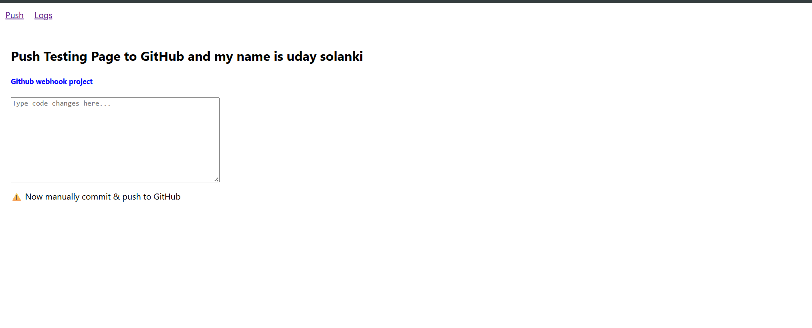
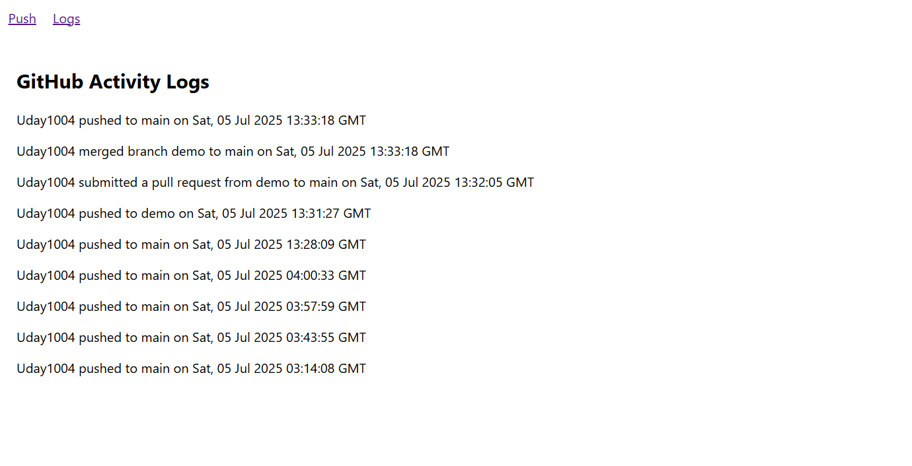

# GitHub Webhook Logger (React + Flask)

This project tracks GitHub events like **push**, **pull_request**, and **merge** using webhooks and displays them in a frontend UI.

---

## 🔧 Project Overview

I created two dedicated pages in the React frontend:

- **UI Update Page**: A sample interface to simulate app updates
- **Logs Page**: Displays GitHub webhook events like push, pull request, and merge in real-time, with timestamps in IST + UTC.

---

## 🌐 Webhook Setup

The Flask backend receives GitHub webhook payloads and stores them in MongoDB. Events supported:

- `push`: Triggered on code push
- `pull_request`: Triggered when PR is opened/closed
- `merge`: Custom handler for PR merges (usually inferred)

### 🛠️ Webhook Endpoint Example

Each event is saved and rendered with timestamps in **IST + AM/PM** and **UTC** formats.

---

## 🖼️ Proof of Concept (Screenshots)

### UI Update Page

### Logs Page

> 📁 Place your images inside a folder like `/screenshots` in your project root.

---

## 🚀 Tech Stack

- **Frontend**: React (Create React App)
- **Backend**: Flask + MongoDB
- **Webhook Events**: push, pull_request, merge
- **Time Zones**: IST (with AM/PM) and UTC displayed side-by-side
